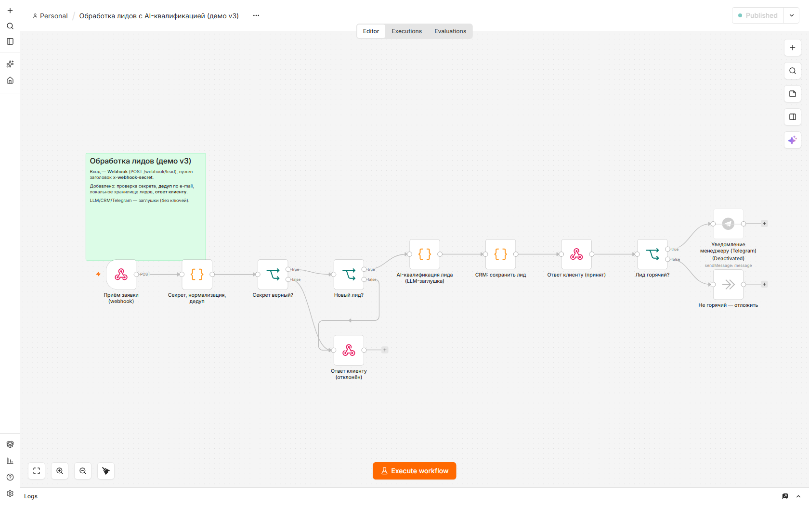
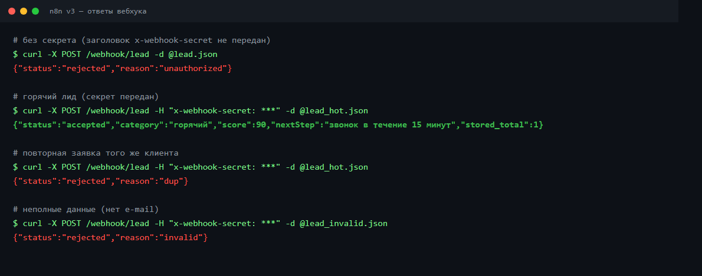
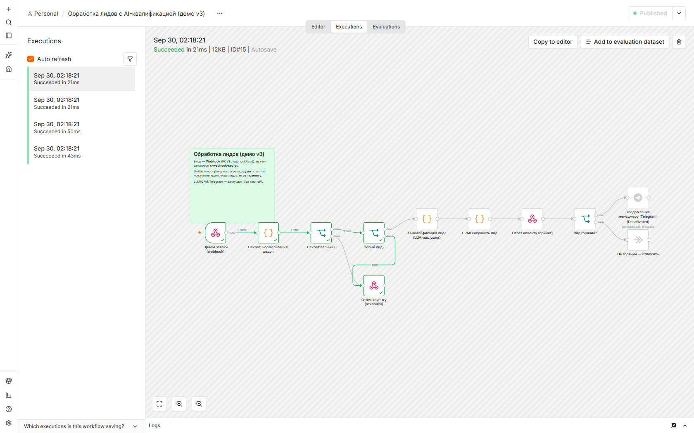

# Обработка лидов с AI-квалификацией (n8n)

Демонстрационный сценарий автоматизации в **n8n**: заявка принимается вебхуком,
**ИИ оценивает лид** (горячий / тёплый / холодный), результат пишется в хранилище,
а по «горячим» лидам уходит уведомление менеджеру в Telegram.

Это прототип на нейтральных данных: внешние сервисы (LLM, CRM, Telegram) заменены
детерминированными заглушками, поэтому всё **работает без ключей и аккаунтов**.
В проде заглушки заменяются на реальные сервисы — структура сценария не меняется.


## Что делает

```
POST /webhook/lead
      │  (заголовок x-webhook-secret)
      ▼
1. Проверка секрета ── нет ─▶ ответ rejected / unauthorized
      │ да
      ▼
2. Нормализация + дедуп по e-mail ── дубль/мусор ─▶ ответ rejected / dup | invalid
      │ новый
      ▼
3. AI-квалификация (оценка 0–100, категория, приоритет, следующий шаг)
      ▼
4. Сохранение лида (локальное хранилище n8n)
      ▼
5. Ответ клиенту: accepted + категория + оценка + следующий шаг
      ▼
6. Лид «горячий»? ── да ─▶ уведомление менеджеру (Telegram)

Отдельный сценарий ловит ошибки выполнения.
```



## Стек

- **n8n** — оркестрация
- **LLM** — квалификация (в демо — детерминированный скоринг)
- **Хранилище** — локальное (в проде — CRM / Google Sheets)
- **Telegram** — уведомление (узел готов, включается после добавления бота)

## Быстрый старт

1. Запустить n8n:
   ```bash
   npx n8n
   ```
2. Открыть `http://localhost:5678`, залогиниться/пройти первичную настройку.
3. **Workflows → Import from File** → выбрать `workflows/lead-qualification-demo-v3.json`.
   При желании также импортировать `workflows/error-handler-demo.json`.
4. Открыть сценарий и нажать тумблер **Active** (включит production-вебхук).
   - Если импортирован обработчик ошибок, привязать его: **⋯ → Settings → Error Workflow**.
5. Отправить тестовую заявку (см. ниже).

## Примеры запросов

```bash
# горячий лид (секрет передан)
curl -X POST http://localhost:5678/webhook/lead \
  -H "Content-Type: application/json" \
  -H "x-webhook-secret: demo-secret-123" \
  -d @examples/lead_hot.json
# → {"status":"accepted","category":"горячий","score":90,"nextStep":"...","stored_total":1}

# повторная заявка того же клиента
curl -X POST http://localhost:5678/webhook/lead \
  -H "Content-Type: application/json" \
  -H "x-webhook-secret: demo-secret-123" \
  -d @examples/lead_hot.json
# → {"status":"rejected","reason":"dup"}

# без секрета
curl -X POST http://localhost:5678/webhook/lead \
  -H "Content-Type: application/json" \
  -d @examples/lead_hot.json
# → {"status":"rejected","reason":"unauthorized"}
```

Ответы вебхука:



Детали выполнения в n8n:



## Результаты по типам лидов

| Тип | Пример | Результат |
|---|---|---|
| 🔥 Горячий | Стартап Neo (внедрение ИИ, 150 000 ₽) | `accepted` → уведомление менеджеру |
| 🌤 Тёплый | Клиника «Дента» (SEO, 120 000 ₽) | `accepted` → отложить |
| ❄️ Холодный | ООО «Розница» (полиграфия, 30 000 ₽) | `accepted` → отложить |
| ⚠️ Неполный | без e-mail | `rejected / invalid` |
| ♻️ Дубликат | повторная заявка | `rejected / dup` |

## Что реализовано

- Приём заявок через **вебхук** (POST /webhook/lead)
- **Проверка секрета** запроса (заголовок `x-webhook-secret`)
- **Валидация** данных и **дедуп** по e-mail
- **AI-квалификация**: оценка, категория, приоритет, следующий шаг
- **Локальное хранилище** лидов
- **Ответ клиенту** с результатом квалификации
- **Ветвление** по «горячим» лидам
- **Отдельный сценарий обработки ошибок**

## Что заглушки и как перенести в прод

| Компонент | В демо | В проде |
|---|---|---|
| LLM | Code-узел со скорингом | узел LLM (OpenAI и др.) с structured output |
| CRM | локальное хранилище n8n | интеграция CRM / Google Sheets |
| Telegram | узел выключен | бот @BotFather + credentials |
| Секрет | константа в коде | переменные окружения / credentials |

## Структура

```
├─ workflows/
│  ├─ lead-qualification-demo-v3.json   # основной сценарий
│  └─ error-handler-demo.json           # обработка ошибок
├─ examples/                            # примеры заявок
├─ docs/                                # схема, скриншоты, демо-видео
├─ README.md
└─ .gitignore
```

## Примечания

- Это **демонстрационный прототип**, а не боевая система.
- Секрет `demo-secret-123` — учебный; в проде не хранить в коде.
- Демо: `docs/demo.gif` (проигрывается на этой странице) и видео `docs/demo.mp4`.
